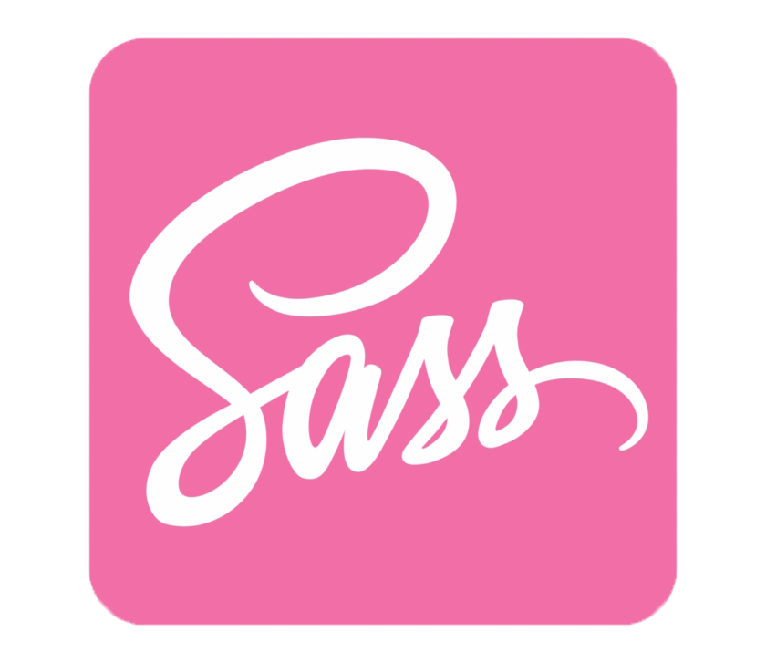

<h1 align="center">Hola! Soy Juan Pablo.</h1>
<h3 align="center">👉Hola, mi nombre es Juan Pablo, soy Desarrollador Full Stack y Fotógrafo. Después de pasar 14 años en una empresa, de los cuales los últimos 9 años fueron como supervisor, el cual me dio la experiencia de transformar un sector de la empresa y formar un equipo de trabajo excelente como así también el desafío diario de la resolución de problemas. 
Comencé aprendiendo lo básico de manejo de PC, luego reparación de pc y redes, ahí descubrí el diseño y aprendí de forma autodidacta algunas herramientas, hasta mi primer curso de diseño web (2009). Después curse la carrera de Técnico Superior en Fotografía, que me dio más herramientas y experiencia en diseño. 
Hoy ya teniendo los siguientes conocimientos JavaScript, React, Redux, NodeJs, Express, PostgreSQL y aún más lenguajes por seguir aprendiendo, es momento de poner mi experiencia junto a mis conocimientos a disposición de quien la requiera y comenzar una nueva etapa, logrando reunir todo lo aprendido con el fin de poder crecer como desarrollador, por eso estoy en búsqueda de ese grupo de trabajo que me brinde la oportunidad de demostrarle mis aptitudes y predisposición para llevar a cabo los objetivos propuestos
</h3>

- 🔭Actualmente estoy desempleado

- 📫 Cómo contactarme:
<table align="center">
<tr>
<td align="center" width="100" height="100">
</td>
<td align="center" width="100" height="100">
</td>
<td align="center" width="100" height="100">
</td>
<td align="center" width="100" height="100">
</td>
<td align="center" width="100" height="100">
</td>
</tr>
</table>

Lenguajes y herramientas  
 

<table align="center">
  <tr>
    <td align="center" width="100" height="100">
      
       HTML 5
    </td>
    <td align="center" width="100" height="100">
      
       CSS 3
    </td>
    <td align="center" width="100" height="100">
      
       JavaScript
    </td>
    <td align="center" width="100" height="100">
      
       ReactJS
    </td>
    <td align="center" width="100" height="100">
      
       Redux
    </td>
    <td align="center" width="100" height="100">
      
       NodeJS
    </td>
    <td align="center" width="100" height="100">
      
       Sass
    </td>
    </tr>
    </table>
    <table align="center">
    <tr>
    <td align="center" width="100" height="100"> 
      
       ExpressJS
    </td>
    <td align="center" width="100" height="100">
      
       PostgreSQL
    </td>
    <td align="center" width="100" height="100">
      
       Sequelize
    </td>
    <td align="center" width="100" height="100">
      
       Git
    </td>
    <td align="center" width="100" height="100">
      
       Salesforce
    </td>
    <td align="center" width="100" height="100">
      
       Next.js
    </td>
    <td align="center" width="100" height="100">
      
       Styled Components
    </td>
  </tr>
</table>

 

 

 

 
<h4 align="center">Visitor's</h4>

